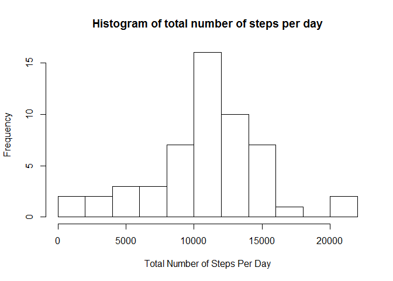
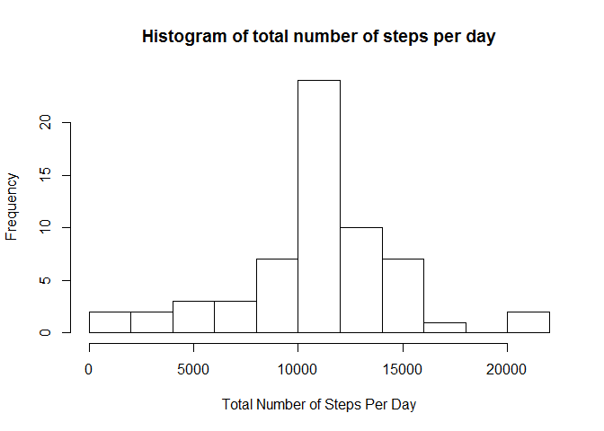

# PA1_template.Rmd
Maxshrike  
Wednesday, October 14, 2015  
#Introduction
This is an R Markdown document that will be used for the Coursera peer assignment #1.  The data used in this assignment is taken from data about personal movement using activity monitoring devices such as [Fitbit](http://www.fitbit.com/), [Nike Fuelband](http://www.nike.com/us/en_us/c/nikeplus-fuel) and [Jawbone Up](https://jawbone.com/up). The dataset can be downloaded from the course website

Data: [Activity Monitoring Data](https://d396qusza40orc.cloudfront.net/repdata%2Fdata%2Factivity.zip).

The variables included in this dataset are:

- **steps:** Number of steps taking in a 5-minute interval (missing values are coded as NA) 
- **date:** The date on which the measurement was taken in YYYY-MM-DD format
- **interval:** Identifier for the 5-minute interval in which measurement was taken

The dataset is stored in a comma-separated-value (CSV) file and there are a total of 17,568 observations in this dataset.

#Start of Assignment
##Loading and preprocessing the data

Set the global items like the necessary packages, and the echo=TRUE option so that the code chunks may be observed.

```r
library(knitr)
```

```
## Warning: package 'knitr' was built under R version 3.2.1
```

```r
library(ggplot2)
```

```
## Warning: package 'ggplot2' was built under R version 3.2.1
```

```r
library(dplyr)
```

```
## 
## Attaching package: 'dplyr'
## 
## The following object is masked from 'package:stats':
## 
##     filter
## 
## The following objects are masked from 'package:base':
## 
##     intersect, setdiff, setequal, union
```

```r
library(lattice)
opts_chunk$set(echo = TRUE)
```

###Download and read the data file

```r
#data download website
url<-"http://d396qusza40orc.cloudfront.net/repdata%2Fdata%2Factivity.zip"
download.file(url, "activity.zip", mode="wb")
unzip("activity.zip")
#read in csv data
rawdata<-read.csv("activity.csv", header=TRUE, colClasses=c("numeric", "character", "numeric"))
rawdata$date <- as.Date(rawdata$date, format = "%Y-%m-%d")
```

##What is the mean total number of steps taken per day?
###**The mean total number of steps is shown in the histogram below**

```r
#calculate the total number of steps per day
totalsteps<-aggregate(steps~date,rawdata, sum)
hist(totalsteps$steps, breaks=10, xlab="Total Number of Steps Per Day", main="Histogram of total number of steps per day")
```

 

##What is the mean of total steps per day?

```r
#calculate the mean of total steps per day
meantotalsteps=mean(totalsteps$steps)
meantotalsteps
```

```
## [1] 10766.19
```
###**The mean number of steps taken per day is 10766.**

##What is the median of total steps per day?

```r
#calculate the median of total steps per day
mediantotalsteps=median(totalsteps$steps)
mediantotalsteps
```

```
## [1] 10765
```
###**The mean number of steps taken per day is 10765.**


##What is the average daily activity pattern?
###**The average daily activity pattern is shown in the plot below**

```r
#calculate the average number of steps per interval
avgsteps<-aggregate(steps~interval,rawdata, mean)
#data is already aggregated to a time series, 0=12:00am, 2355=11:55pm in 5 min increments
ggplot(data=avgsteps, aes(x=interval, y=steps)) + geom_line()+ theme_bw() + xlab("Clock Time") + ylab("Average number of Steps")
```

 

##Which 5-minute interval, on average across all the days in the dataset, contains the maximum number of steps?

```r
#calculate the timestep for which the max # of avg steps per day occurs
maxstep=avgsteps[which.max(avgsteps$steps),1]
maxstep
```

```
## [1] 835
```

```r
maxcount=avgsteps[which.max(avgsteps$steps),2]
maxcount
```

```
## [1] 206.1698
```
###**The 5 minute interval that contains the maximum number of steps is at 835. This maximum step count is 206.**


##Imputing Missing Values
### Calculate and report the total number of missing values in the data set

```r
missingval<-sum(is.na(rawdata$steps))
missingval
```

```
## [1] 2304
```
###**The total number of missing values is 2304**

##Devise a strategy for filling in all of the missing values in the dataset. 
###**My Strategy: We will replace missing 5 minute interval values (NA's) with the mean value.**  

##Create a new dataset that is equal to the original dataset but with the missing data filled in.


```r
#need to have distinct variable name to perform the merge using interval as the index
colnames(avgsteps)[2]="avg_steps"
#first merge the two data sets using interval as the merge index
mergeddata<-merge(rawdata, avgsteps, by="interval")
#now replace the NA's with the 'avg step' data
mergeddata$steps <- ifelse(is.na(mergeddata$steps), mergeddata$avg_steps, mergeddata$steps)
```

##Make a histogram of the total number of steps taken each day and Calculate and report the mean and median total number of steps taken per day.


```r
#next, aggregate the data per day as a sum
totalsteps<-aggregate(steps~date,mergeddata, sum)
#next plot the new histogram of the NA-replaced data
hist(totalsteps$steps, breaks=10, xlab="Total Number of Steps Per Day", main="Histogram of total number of steps per day")
```

 

```r
#compute the mean
newmean=mean(totalsteps$steps)
newmean
```

```
## [1] 10766.19
```

```r
#compute the median
newmedian=median(totalsteps$steps)
newmedian
```

```
## [1] 10766.19
```
###**The mean number of steps taken per day is 10766 and the median number of steps taken per day is 10766**.

##Do these values differ from the estimates from the first part of the assignment? 
###**The mean value does not differ from the first part.**  
###**The median value only differs by 1 step.**

##What is the impact of imputing missing data on the estimates of the total daily number of steps?
###**There isn't a large impact on the estimates of total daily number of steps when using the imputed values technque.**

##Are there differences in activity patterns between weekdays and weekends?


```r
#make a new column that will call out weekdays
mergeddata$day <- weekdays(as.Date(mergeddata$date))
#make the days a factor for weekends and weekdays
mergeddata$day <- ifelse(mergeddata$day %in% c("Saturday","Sunday"), "Weekend","Weekday")
```

##Make a panel plot containing a time series plot of the 5-minute interval (x-axis) and the average number of steps taken, averaged across all weekday days or weekend days (y-axis).


```r
#Calculate the average steps by weekday/weekend
activity_impute_mean <- mergeddata %>% group_by(day, interval) %>% 
  summarize(mean.steps = mean(steps))

#plot the time series chart
xyplot(mean.steps ~ interval | day, data = activity_impute_mean, 
       type = "l", layout = c(1,2), xlab = "Interval", ylab = "Avg Number of Steps", 
       main = "Average Steps by 5-minute Interval for Weekends and Weekdays")
```

 


###**From the plot above, the differences can be seen in activity between weekends and weekdays.  The plots suggest that people are more active during the weekends than they are during the week.**
